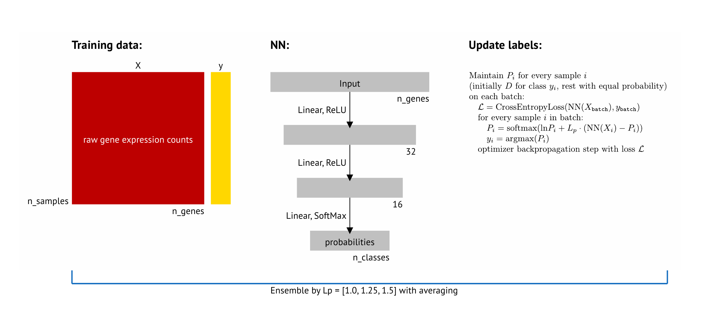

<p align="center">
  
</p>

scROCK (<ins>s</ins>ingle-<ins>c</ins>ell <ins>R</ins>efinement <ins>O</ins>f <ins>C</ins>luster <ins>K</ins>nitting) is an algorithm for correcting cluster labels for scRNA-seq data, based on [Xinchuan Zeng and Tony R. Martinez. 2001. An algorithm for correcting mislabeled data. Intell. Data Anal. 5, 6 (December 2001), 491–502.](https://dl.acm.org/doi/10.5555/1294000.1294004).

## How scROCK works
scROCK uses a supervised machine learning algorithm called ADE (automatic data enhancement). It is based on ability of neural networks to remember first simple and correct class labels and then incorrect ones. During the training of a small neural network, scROCK maintains smoothed class probabilities for every sample, and changes dataset labels according to them.



Final class labels after a fixed number of epochs or batches are considered as "fixed" and returned by `scrock` call.


## Installation

```pip install https://github.com/dos257/scROCK/tarball/master```

For private repository use:
```pip install git+https://{token}@github.com/dos257/scROCK.git```

Use keys `--upgrade --no-deps --force-reinstall` for forced update from the git repository.


## Usage

If `X` is log1p-preprocessed `numpy.array` of shape `(n_samples, n_genes)` and `y` is integer clustering labels (from Leiden algorithm),

```python
from scrock import scrock
y_fixed = scrock(X, y)
```


## Docker (minimal)
For convenience, `scrock` supports a simplified command line:
```
python3 -m scrock refine_clusters data.h5ad
```
or `find_doublets` instead of `refine_clusters`

For the `refine_clusters` task, from file (here `data.h5ad`) `scrock` tries to read (in that order) `.obs["seurat_clusters"]`, `.obs["leiden"]`, `.obs["cell_line"]`.

Also, this command line could be run inside Docker.

Build Docker image:
```
docker build --tag scrock-image .
```
Run Docker image passing host path with input file:
```
docker run --name scrock --volume /host-path-to-input/data:/data scrock-image refine_clusters /data/sce_sc_10x_5cl_qc.h5ad
```
Output will be written to stdout.


## Docker (maximal)
Library `scrock` is included in a large Docker image [`scMultiFlow`](https://github.com/dos257/scMultiFlow), with Anaconda, RStudio, and bioinformatics libraries. To use it, run
```
docker pull bansalvi/scmultiflow
docker run --detach -p 18000:8000 -p 18787:8787 \
    --volume "$(realpath ..)/data":/data \
    --name scmultiflow-container bansalvi/scmultiflow
```


## Known issues
If code consumes a high CPU percent (but still works slowly), try:

```python
torch.set_num_threads(1)
```

Torch imperfect CPU parallelization spends most of the time in thread synchronization and slows down the whole process.


## API
Main entry point of the library is the `scrock` function:
```python
def scrock(
    X, y,
    D = 0.9,
    l_ps = [1.0, 1.25, 1.5],
    net_factory = None,
    label_update_factory = None,
    optimizer = 'adam', optimizer_lr = 0.0001, n_epochs = 40, n_batches = None, batch_size = 32,
    batch_scheme = 'random-shuffle',
    voting_scheme = voting_scheme_max_p_sum,
    verbose = 1,
    check_data = True,
    seed = 0,
    return_proba = False,
):
```
This function runs the scROCK ensemble algorithm, using `X` and `y` as the input dataset. It averages ADE algorithm results (3 by default, with parameters from `l_ps`) by `voting_scheme`.

Parameter `net_factory` configures neural network, parameters `optimizer`, `optimizer_lr`, `n_epochs`, `n_batches`, `batch_size`, `batch_scheme` how it trains, parameter `label_update_factory` how algorithm updates class labels during training.

Parameter `verbose` controls debug output. Parameter `seed` is used for random generator initialization for ensemble items (by `seed + ialgo`).

If parameter `return_proba` is `True`, `scrock` returns `y_pred, y_pred_proba` instead of `y_pred`.

Function `scrock` wraps methods of class `ADEReClassifier`:

```python
class ADEReClassifier(BaseReClassifier):
    def __init__(
        self,
        l_p = 1.0,
        D = 0.9,
        net = None,
        label_update = None,
        label_update_first_update = 300,
        optimizer = 'adam', optimizer_lr = 1e-4, n_epochs = 40, n_batches = None, batch_size = 32, batch_scheme = 'random-shuffle',
        add_on_each_batch = [],
        collect = [],
        verbose = 0,
        seed = 0,
    ):
        ...
    def fit(self, X, y):
        ...
    def predict(self):
        ...
    def predict_proba(self):
        ...
```


## Acknowledgments
scROCK was developed under the supervision of Dr. Vikas Bansal (Head of Biomedical Data Science Group at German Center for Neurodegenerative Diseases (DZNE), Tübingen).
